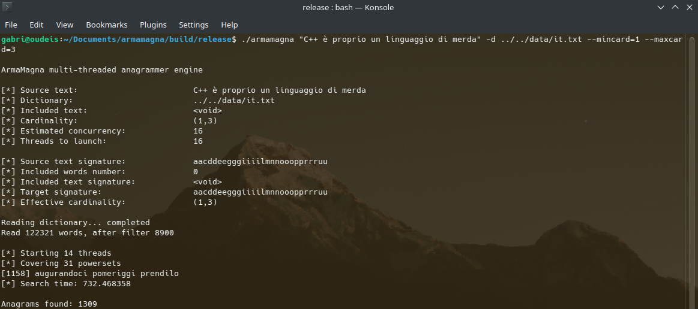

# 📜 **ArmaMagna: Multi-Threaded Anagrammer Engine**



**ArmaMagna** is a command-line anagrammer engine written in **C++23**. Its combinatorial search algorithm is parallelized for high-performance computation.

## ✨ Features

* **Phrase Anagram Support:** Solves anagrams for entire phrases, correctly handling spaces and punctuation within the input text.  
* **Filter by substring (-i/--incl):** Allows users to specify a word or phrase that **must** be present in the final anagram. This severely reduces computation time.
* **Constraints:** Provides control over the anagram structure via two mandatory parameters:  
  * **Cardinality:** Minimum and maximum total number of words in the resulting anagram (--mincard, \--maxcard).  
* **Unicode/Accent Normalization:** Uses the dedicated **StringNormalizer** to handle common accented characters (e.g., é, è, ê are all treated as the base letter e), ensuring compatibility with international dictionaries and inputs.
* **C++23 Standard:** Built using modern C++23 features, including `std::jthread`, C++23 views (`std::views`), default comparisons and more.

## 🧭 **Workflow**

### ⚙️ **1\. Preparation**
The target text and the words in the wordlist are normalized and turned into their signature through the use of the WordSignature class. For example, "bazzecole andanti" becomes its signature "aaabcdeeilnotzz". The signatures are internally represented as a `std::array<int>` of size 26, where each integer represents the frequency of the i-th character in the text. Signatures are processed in the search threads, where the program needs to sum and subtract signatures, besides being able to quickly assess whether two strings have the same signature (i.e. an anagram is found), or if a string is not a substring of the target (i.e. the string must be pruned out).

### 📚 **2\. Dictionary**
The dictionary class, called `Dictionarium`, is a collection of words read from the wordlist. The dictionary words that are not a subset of the target text are filtered out, in order to drastically reduce the search space. The dictionary is divided in sections, where each section corresponds to a specific word length. For example, the section at index 3 only contains words with 3 letters. Sections are represented as hashmaps mapping a signature to its corresponding words, i.e. `ankerl::unordered_dense::map<WordSignature, std::vector<std::string>>`. This architecture is comes in handy in the search algorithm, where we combine signatures and not individual words.

### 🔢 **3\. Repeated combinations with sum**
Given the target text "bazzecole andanti" (of length 15), we need to generate all possible word lengths whose sum is 15. For example `[14, 1], [6, 6, 3], [4, 4, 4, 3]`, and many more. This way, the search algorithm can fetch words with the right length from the corresponding dictionary section. The generation of such sets adheres to the minimum and maximum cardinality constraints. Since the dictionary filters out words that are not subsets of the target text, some dictionary sections may remain empty. The dictionary subsequently filters out sets that contain such empty sections.

### ⚡ **4\. Concurrent search**
A threadpool is generated with `boost::asio`, and every task sent to the pool performs its search on one of the previously generated sets. The search algorithm is recursive, combinatorial, and quite similar to the repeated combinations with sum. In this case, we generate combinations of word signatures, with the constraint of having a fixed cardinality (given by the length of each set), and the constraint of the signature being equal to the target's. With a producer-consumer paradigm, the producer tasks push anagrams into a shared queue. The consumer I/O loop pops anagrams from the queue and outputs them to file.

## 🛠️ Build Instructions

The project uses **CMake** with C++23 and requires external dependencies: **Boost** (thread/system) and **CLI11**. Boost must be installed on your system, whereas CLI11 is header-only and is already included in the project.

### Prerequisites

* A C++ compiler supporting **C++23** (e.g., GCC 13+ or Clang 16+).
* **CMake** (version 3.26 or higher).
* **Boost** (version 1.74 or higher, specifically `thread`).

### Building

The project uses `CMakePresets.json` to define build presets.

1.  **Clone the repository:**
    ```bash
    git clone https://github.com/merhametsize/armamagna.git
    cd armamagna
    ```

2.  **Configure and Build (Release Mode - Optimized):**
    This preset applies `-O3` and `-DNDEBUG` for maximum performance.
    ```bash
    cmake --preset release
    cmake --build --preset release
    ```
    *The executable is located at `./build/release/armamagna`.*

3.  **Configure and Build (Debug Mode - Sanitized):**
    This preset enables address, undefined, and leak sanitizers.
    ```bash
    cmake --preset debug
    cmake --build --preset debug
    ```
    *The executable is located at `./build/debug/armamagna`.*

## 💻 Usage

The executable is run on terminal using the required positional and named arguments provided by **CLI11**. All anagrams are written to `anagrams.txt`.

```bash
./armamagna <text_to_anagram> -d <dictionary_path> --mincard <min_words> --maxcard <max_words> [optional_flags]
```

For example:
```bash
./armamagna "sator arepo tenet opera rotas" -d ../../data/dizionario-italiano.txt -i "trota" --mincard 1 --maxcard 3 [optional_flags]
```

