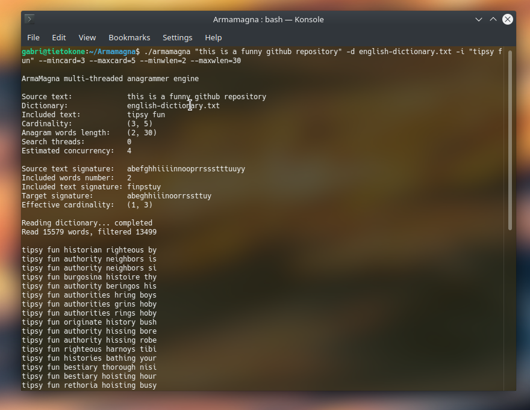

# **ArmaMagna: High-Speed Multi-Threaded C++ Anagrammer Engine**

**ArmaMagna** is a powerful and highly efficient command-line anagram solver built in C++. It utilizes **parallel processing** and specialized data structures to quickly find complex, constrained phrase anagrams.

## **✨ Key Features**

* **Phrase Anagram Support:** Solves anagrams for entire phrases, correctly handling spaces and punctuation within the input text.  
* **Mandatory Substring (-i/--incl):** Allows users to specify a word or phrase that **must** be present in the final anagram. The engine intelligently subtracts these letters from the pool before searching.  
* **Robust Constraint System:** Provides precise control over the output structure via five mandatory parameters defined by the user:  
  * **Word Count:** Minimum and maximum total number of words in the resulting anagram (--mincard, \--maxcard).  
  * **Word Length:** Minimum and maximum length for individual words (--minwlen, \--maxwlen).  
* **Unicode/Accent Normalization:** Uses the dedicated **StringNormalizer** to handle common accented characters (e.g., é, è, ê are all treated as the base letter e), ensuring compatibility with international dictionaries and inputs.

## **⚡ High Performance Architecture**

The engine achieves its high performance through three primary architectural pillars:

### **1\. Signature-Based Dictionary Indexing**

* **WordSignature**: The core data structure for performance. Every word is represented by a **signature**—a canonical map of its character frequencies (e.g., "star" and "rats" both map to an identical signature of letter counts).  
* **Rapid Pruning**: The search leverages signature arithmetic (+=, \-=) and the **isSubsetOf** check. This allows the engine to instantly determine if a partial anagram combination uses more letters than available in the target text, significantly pruning the search space.

### **2\. Optimized Dictionary Filtering (SmartDictionary)**

* The dictionary is loaded once, normalized, and indexed by signature.  
* The dictionary is organized into **sections by word length**, accelerating the iterative search.  
* Any word whose signature is **not a subset** of the input text's signature is immediately discarded, reducing the effective dictionary size used during the search.

### **3\. Parallel Processing (SearchThread & PowerSet)**

* The problem is divided using the **PowerSet** class, which pre-calculates all valid word length combinations that satisfy the user's constraints.  
* Each of these length combinations is assigned to a dedicated **SearchThread**, allowing the engine to leverage multiple CPU cores for concurrent searching.

## **🛠️ Usage and Compilation**

ArmaMagna requires C++11 or later and utilizes a standard Makefile for compilation.

### **Compilation**

1. **Clone the repository (or download the source files):**  
   \# Replace with your actual repository URL if hosted  
   git clone \[repository-url\]  
   cd armamagna

2. **Compile the project:**  
   The included Makefile handles all dependencies, compilation flags, and linking. Simply run:  
   make

   *(Note: The build is configured to use the C++11 standard, includes the **\-O2** optimization flag, and links the **Pthreads library** for multi-threaded execution.)*

### **Execution**

The application requires the target text, the dictionary path, and all four constraint parameters (--mincard, \--maxcard, \--minwlen, \--maxwlen) to run.  
\# General Usage Pattern  
./armamagna \<source text\> \-d \<dictionary.txt\> \--mincard=\<N\> \--maxcard=\<N\> \--minwlen=\<N\> \--maxwlen=\<N\> \[optional: \-i \<text\>\]  

